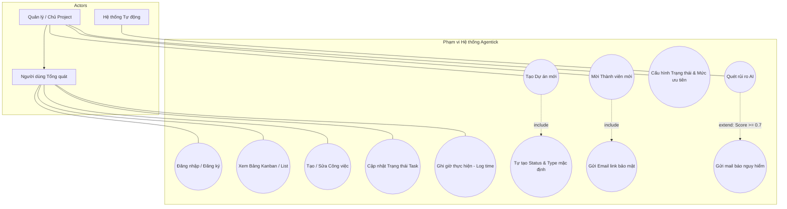
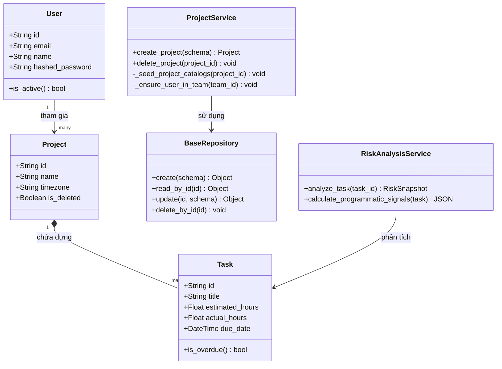
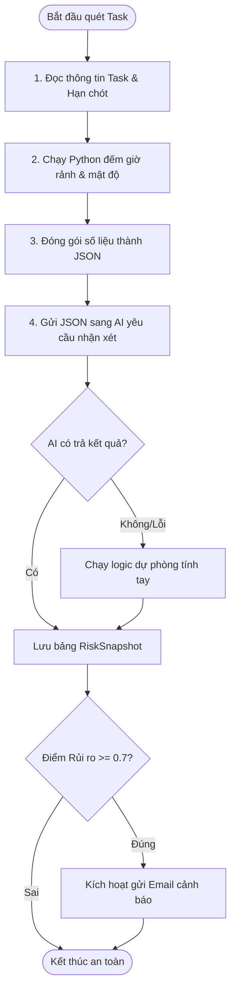
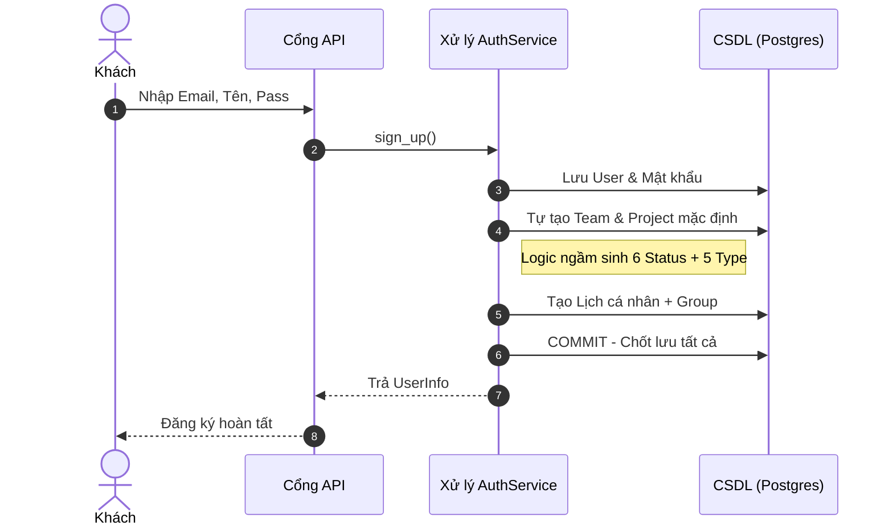
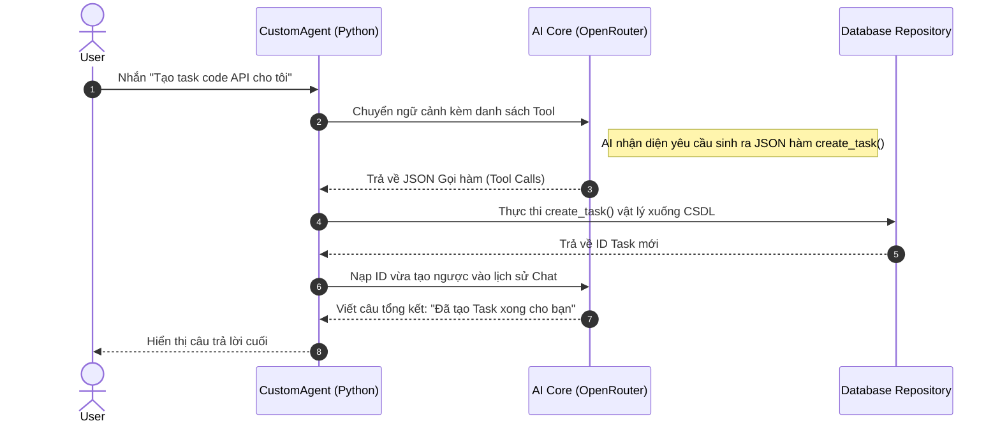
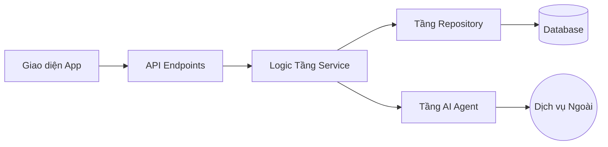
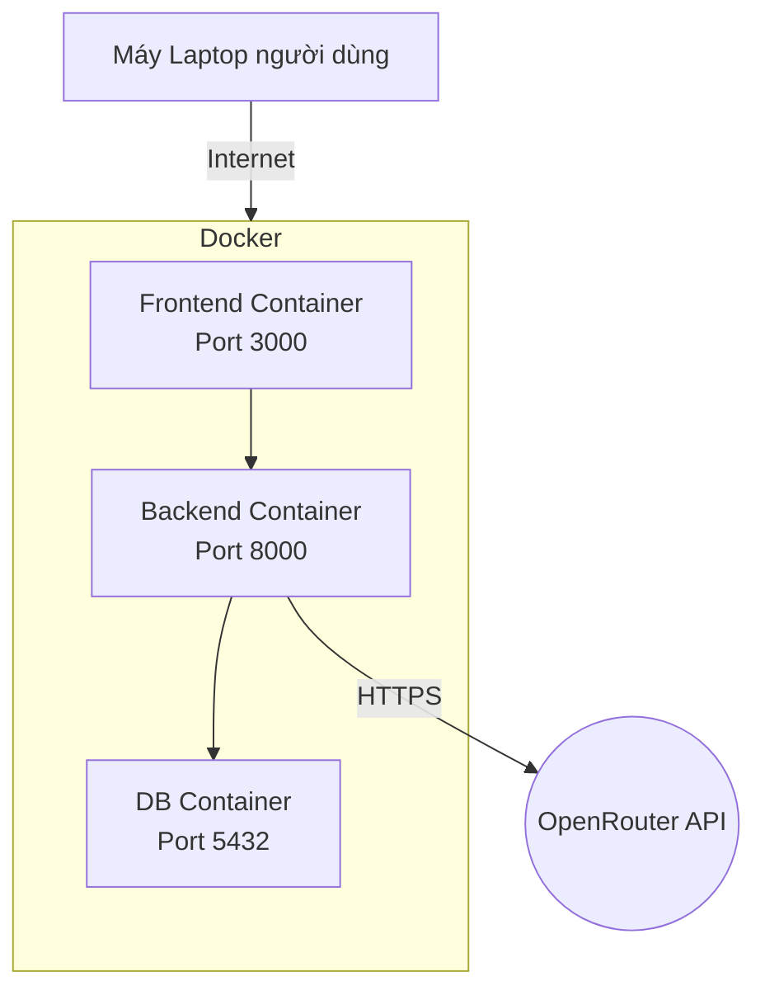

# 3. Sơ đồ Hệ thống UML (UML System Diagrams)

Tài liệu này cung cấp đầy đủ bộ bản vẽ chuẩn UML phục vụ trực tiếp cho công tác phân tích nghiệp vụ (BA) và thiết kế phần mềm.

---

## 3.1. Biểu đồ Tác nhân & Ca sử dụng (Use Case Diagram)
Mô tả những AI có quyền làm GÌ trên hệ thống, phân tách rõ ràng bằng quan hệ kế thừa.

---

## 3.2. Biểu đồ Lớp (Class Diagram)
Mô tả cấu trúc thực thể dữ liệu và các phương thức (methods) xử lý đi kèm.

---

## 3.3. Biểu đồ Hoạt động (Activity Diagram)
Lột tả luồng rẽ nhánh (Logic Decision) của tính năng lõi phức tạp nhất: Phân tích Rủi ro.

---

## 3.4. Biểu đồ Tuần tự (Sequence Diagram)
Ghi lại lịch sử giao tiếp vượt tầng giữa các module của hệ thống.

### 3.4.1. Luồng Đăng ký & Chuẩn bị Dữ liệu (Auth Bootstrap)

### 3.4.2. Luồng Xử lý Agentic Tool (Actionable LLM)
Mô tả cách AI tự động chuyển đổi từ Chat thành Hành động viết xuống CSDL.

---

## 3.5. Biểu đồ Thành phần & Triển khai (Physical Layout)

### 3.5.1. Sơ đồ Thành phần (Component)

### 3.5.2. Sơ đồ Triển khai (Deployment)

