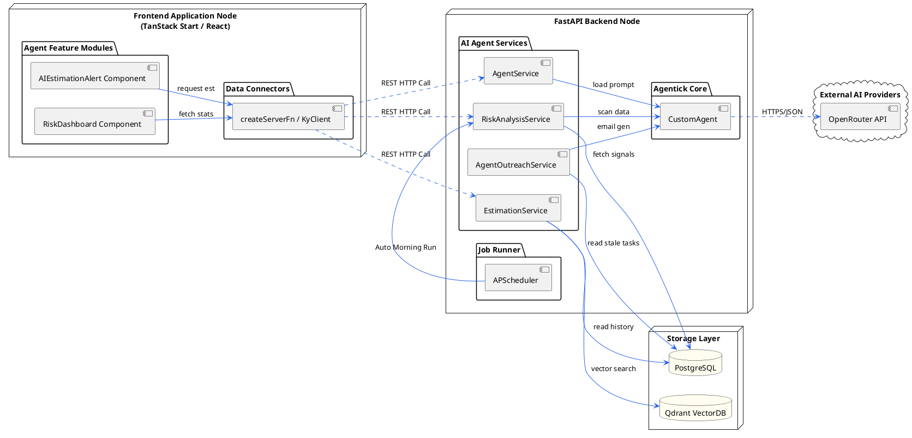
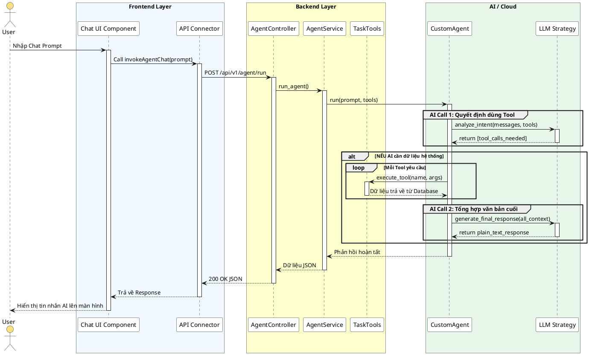
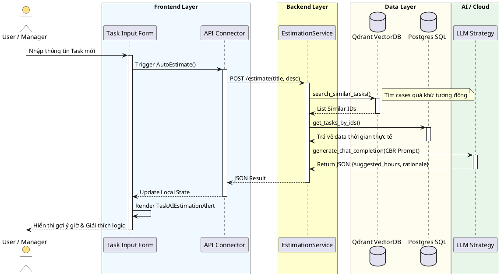
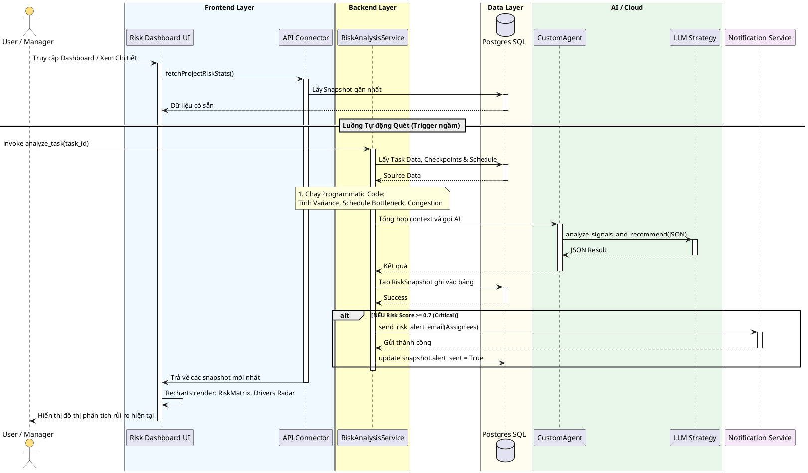
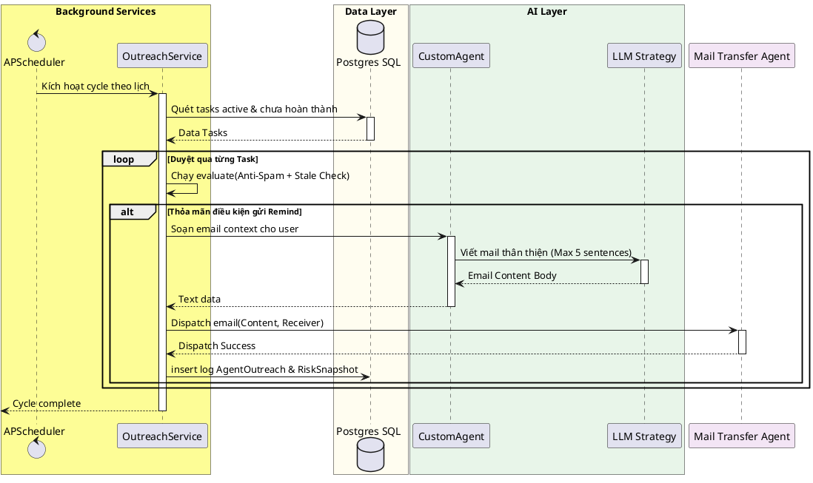

# Tài liệu Kỹ thuật: Hệ thống Dịch vụ AI Agent - Agentick

Tài liệu này cung cấp cái nhìn tổng quan và chi tiết về các dịch vụ AI Agent hiện có trong dự án **Agentick**, bao gồm cả logic xử lý ngầm tại **Backend** (Python FastAPI) và trải nghiệm tương tác, hiển thị trực quan tại **Frontend** (React TanStack Start).

Hệ thống AI của Agentick được tích hợp xuyên suốt từ tầng hiển thị dashboard biểu đồ rủi ro, cảnh báo tại giao diện người dùng cho đến tầng lõi phân tích AI phía backend và các trình lập lịch background jobs.

---

## 1. Kiến trúc Tổng quan (High-Level Architecture)

Kiến trúc AI tuân theo mô hình hóa chiến lược (Strategy Pattern), cho phép thay đổi LLM backend linh hoạt thông qua `LLMStrategy` (hiện tại sử dụng `OpenRouterStrategy`).

---

## 2. Các Dịch vụ AI Agent Chi tiết

### 2.1 Agent Service (Trợ lý Tương tác Trực tiếp)

**Mô tả:**
Cung cấp một Chatbot thông minh có khả năng sử dụng công cụ (Tool Use/Function Calling) để thao tác trực tiếp với dữ liệu hệ thống (nhiệm vụ, dự án) theo yêu cầu tự nhiên của người dùng thông qua REST API.

**Codebase Liên quan:**
*   **Backend Logic:** `app/services/agent_service.py`, `app/agents/custom_agent.py`
*   **Frontend Integration:** Các components tương tác gọi API proxy hoặc server action.

#### Sequence Diagram: Luồng Tương tác Agent & Tool Calling

---

### 2.2 Estimation Service (Ước lượng Thời gian Thông minh)

**Mô tả:**
Thực hiện ước lượng thời gian (`estimated_hours`) cho một Task mới dựa trên mô hình **Case-Based Reasoning (CBR)** kết hợp RAG. Dịch vụ này truy xuất các task tương tự trong quá khứ từ Qdrant Vector DB, phân tích độ lệch thời gian thực tế và nhờ AI dự đoán. 

Phía Frontend hiển thị lý do giải thích chi tiết sự lựa chọn thời gian của AI để tăng tính minh bạch.

**Codebase Liên quan:**
*   **Backend Service:** `app/services/estimation_service.py`
*   **Frontend Component:** `features/tasks/components/task-table/task-ai-estimation-alert.tsx` (Dùng hiển thị reasoning_steps: similarity & variance analysis)

#### Use Case & Flow Diagram

---

### 2.3 Risk Analysis Service (Phân tích & Cảnh báo Rủi ro)

**Mô tả:**
Một dịch vụ "Hybrid" kết hợp giữa các thuật toán xác định (Deterministic) và AI tổng hợp. Hệ thống tự động tính toán các chỉ số rủi ro (Tiến độ, Trễ lịch trình, Xung đột tải công việc), sau đó chuyển cho AI Agent để đưa ra đánh giá rủi ro chi tiết và các khuyến nghị quản lý (Managerial recommendations).

Phía Frontend tổng hợp dữ liệu snapshot rủi ro và hiển thị qua Dashboard trực quan sử dụng `recharts` (Radar, Scatter plots, v.v.).

**Codebase Liên quan:**
*   **Backend Service:** `app/services/risk_analysis_service.py`
*   **Frontend Feature:** `features/agent/components/*`
    *   `project-risk-dashboard.tsx`: Tổng quan dashboard.
    *   `risk-matrix-chart.tsx`: Phân bổ rủi ro dạng scatter plot.
    *   `risk-drivers-chart.tsx`: Biểu đồ radar phân tích yếu tố rủi ro.

#### Sequence Diagram: Luồng Phân tích Rủi ro tự động

---

### 2.4 Các Dịch vụ Chạy Ngầm (Silent Services)

Hệ thống bao gồm hai cơ chế chạy ngầm chính vận hành bởi **APScheduler** kết hợp cùng các logic AI để tự động hóa việc theo dõi dự án:

#### A. Scheduler & Risk Management Lifecycle

**Mô tả:**
Bộ lập lịch `app/core/scheduler.py` đảm bảo việc phân tích rủi ro diễn ra tự động vào đầu ngày và báo cáo tổng hợp vào cuối ngày, căn cứ chính xác theo **Timezone** của từng dự án.

1.  **Morning Scan Job (9:00 AM Local Time):** Duyệt qua tất cả tasks chưa hoàn thành, nếu giờ địa phương của project là 9h sáng, tự động gọi `RiskAnalysisService.analyze_task` bất đồng bộ.
2.  **Evening Summary Job (5:30 PM Local Time):** Quét các Snapshot rủi ro được tạo ra trong ngày, lọc các rủi ro >= 0.5, tạo template HTML báo cáo và gửi email trực tiếp đến Team Lead.

#### B. Agent Outreach Service (Chăm sóc & Nhắc nhở tự động)

**Mô tả:**
Dịch vụ này hoạt động như một "Quản lý ảo" đi rà soát hệ thống. Khi phát hiện dữ liệu task bị hụt (ví dụ: thiếu giờ ước tính) hoặc task đã quá lâu không có hoạt động (stale updates), dịch vụ sẽ nhờ AI soạn một email nhắc nhở thân thiện, cá nhân hóa để gửi tới Assignee.

**Sử dụng:** `app/services/agent_outreach_service.py`

#### Sequence Diagram: Luồng Chăm sóc & Gửi Mail nhắc nhở

### Tổng hợp các API Trigger cho Background Services

Các dịch vụ ngầm này cũng được expose qua route `/api/v1/agent/` để quản trị viên có thể trigger cưỡng bức ngay lập tức phục vụ demo hoặc xử lý khẩn cấp:
*   `POST /agent/outreaches`: Kích hoạt vòng quét outreach gửi mail nhắc nhở.
*   `POST /agent/morning-scan/trigger`: Cưỡng bức chạy quét rủi ro sáng sớm toàn hệ thống.
*   `POST /agent/evening-summary/trigger`: Gửi báo cáo tổng hợp chiều tối tới Team Lead ngay lập tức.

---
*Tài liệu này được trích xuất và hệ thống hóa tự động dựa trên codebase hiện tại của Agentick.*
