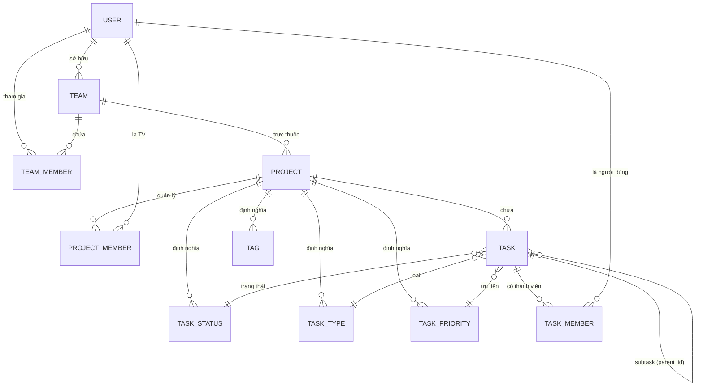
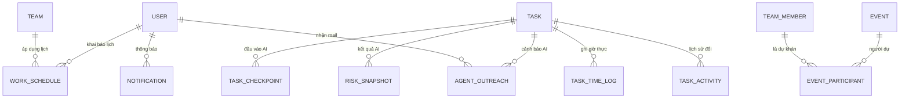

# 5. Cấu trúc Cơ sở Dữ liệu Đầy đủ (Full Database Schema)

Tài liệu này cung cấp danh sách **tất cả các bảng** và **toàn bộ các cột** hiện có trong hệ thống mã nguồn. 
Tất cả thực thể kế thừa `BaseModel` mặc định có 3 cột:
- `id`: `VARCHAR(36)` (UUID PK)
- `created_at`: `TIMESTAMPTZ`
- `updated_at`: `TIMESTAMPTZ`

---

## 5.1. Sơ đồ Quan hệ Thực thể (Entity Relationship Diagram)

Hệ thống được chia làm 2 nhóm để tối ưu hiển thị:

### 5.1.1. Nhóm 1: Cấu trúc Tổ chức Cốt lõi

### 5.1.2. Nhóm 2: Phụ trợ Vận hành & Trí tuệ nhân tạo

---

## 5.2. Đặc tả chi tiết 100% các Bảng Hệ thống

### 5.2.1. Bảng: `user`
Quản lý tài khoản người dùng.
| Tên Cột | Kiểu dữ liệu | Thuộc tính / Mô tả |
| --- | --- | --- |
| `email` | `VARCHAR(255)` | UNIQUE, INDEX, NOT NULL |
| `name` | `VARCHAR(255)` | NOT NULL |
| `hashed_password` | `VARCHAR(255)` | NOT NULL |
| `avatar_url` | `VARCHAR(512)` | NULLABLE |
| `user_token` | `VARCHAR(64)` | UNIQUE, NOT NULL |
| `is_active` | `BOOLEAN` | DEFAULT TRUE |

### 5.2.2. Bảng: `team`
Nhóm làm việc cấp cao nhất (Workspace).
| Tên Cột | Kiểu dữ liệu | Thuộc tính / Mô tả |
| --- | --- | --- |
| `name` | `VARCHAR(255)` | NOT NULL |
| `description` | `VARCHAR(512)` | NULLABLE |
| `avatar_url` | `VARCHAR(512)` | NULLABLE |
| `owner_id` | `VARCHAR(36)` | FK (`user.id`), NOT NULL |
| `is_deleted` | `BOOLEAN` | DEFAULT FALSE |

### 5.2.3. Bảng: `team_member`
Quan hệ phân quyền cấp Team.
| Tên Cột | Kiểu dữ liệu | Thuộc tính / Mô tả |
| --- | --- | --- |
| `team_id` | `VARCHAR(36)` | FK (`team.id`), NOT NULL |
| `user_id` | `VARCHAR(36)` | FK (`user.id`), NOT NULL |
| `role` | `VARCHAR(50)` | Vai trò: owner, manager, member... |
| `joined_at` | `TIMESTAMPTZ` | DEFAULT NOW() |

### 5.2.4. Bảng: `project`
| Tên Cột | Kiểu dữ liệu | Thuộc tính / Mô tả |
| --- | --- | --- |
| `team_id` | `VARCHAR(36)` | FK (`team.id`), NOT NULL |
| `name` | `VARCHAR(255)` | NOT NULL |
| `description` | `TEXT` | NULLABLE |
| `timezone` | `VARCHAR(50)` | DEFAULT 'UTC' |
| `is_deleted` | `BOOLEAN` | DEFAULT FALSE |

### 5.2.5. Bảng: `project_member`
Quan hệ thành viên tham gia Project cụ thể.
| Tên Cột | Kiểu dữ liệu | Thuộc tính / Mô tả |
| --- | --- | --- |
| `project_id` | `VARCHAR(36)` | FK (`project.id`), NOT NULL |
| `user_id` | `VARCHAR(36)` | FK (`user.id`), NOT NULL |
| `role` | `VARCHAR(50)` | default: 'member' |
| `joined_at` | `TIMESTAMPTZ` | DEFAULT NOW() |

### 5.2.6. Bảng: `task`
Lưu trữ công việc chi tiết.
| Tên Cột | Kiểu dữ liệu | Thuộc tính / Mô tả |
| --- | --- | --- |
| `project_id` | `VARCHAR(36)` | FK (`project.id`), NOT NULL |
| `parent_id` | `VARCHAR(36)` | FK (`task.id`), NULLABLE (sub-task) |
| `title` | `VARCHAR(255)` | NOT NULL |
| `description` | `TEXT` | NULLABLE |
| `status_id` | `VARCHAR(36)` | FK (`task_status.id`), NOT NULL |
| `type_id` | `VARCHAR(36)` | FK (`task_type.id`), NOT NULL |
| `priority_id` | `VARCHAR(36)` | FK (`task_priority.id`), NOT NULL |
| `phase_id` | `VARCHAR(36)` | FK (`phase.id`), NULLABLE |
| `started_at` | `TIMESTAMPTZ` | NULLABLE (Ngày bắt đầu thực tế) |
| `completed_at`| `TIMESTAMPTZ`| NULLABLE (Ngày hoàn tất thực tế) |
| `due_date` | `TIMESTAMPTZ` | NULLABLE (Hạn cuối) |
| `order` | `FLOAT` | Thứ tự hiển thị trên Board |
| `estimated_hours`| `FLOAT` | NULLABLE |
| `actual_hours` | `FLOAT` | DEFAULT 0.0 |
| `is_archived` | `BOOLEAN` | DEFAULT FALSE |
| `is_deleted` | `BOOLEAN` | DEFAULT FALSE |

### 5.2.7. Bảng: `task_member`
Quản lý những người tham gia thực hiện hoặc dẫn dắt (lead) một công việc cụ thể. Trỏ trực tiếp vào `user` chứ không qua `project_member`.
| Tên Cột | Kiểu dữ liệu | Thuộc tính / Mô tả |
| --- | --- | --- |
| `task_id` | `VARCHAR(36)` | FK (`task.id`), ON DELETE CASCADE, NOT NULL |
| `user_id` | `VARCHAR(36)` | FK (`user.id`), NOT NULL |
| `role` | `VARCHAR(20)` | Enum string: 'lead', 'member' |
| `joined_at` | `TIMESTAMPTZ` | Thời điểm được add vào task |

### 5.2.8. Cấu hình Metadata Project (Cài đặt riêng)
Bao gồm các bảng định nghĩa bộ giá trị tùy biến cho từng dự án.

**Bảng: `task_status`**
| Tên Cột | Kiểu | Diễn giải |
| --- | --- | --- |
| `project_id` | `VARCHAR(36)`| FK, NOT NULL |
| `name` | `VARCHAR(50)`| Tên status |
| `color` | `VARCHAR(20)`| Mã màu hex |
| `order` | `FLOAT` | Thứ tự hiển thị |
| `is_default` | `BOOLEAN` | Trạng thái mặc định |
| `is_completed`| `BOOLEAN` | Đánh dấu đã hoàn tất |

**Bảng: `task_type`**
| Tên Cột | Kiểu | Diễn giải |
| --- | --- | --- |
| `project_id` | `VARCHAR(36)`| FK, NOT NULL |
| `name` | `VARCHAR(50)`| Tên (Feature, Bug...) |
| `color` | `VARCHAR(20)`| Mã màu hex |
| `icon` | `VARCHAR(100)`| Classname/Tên Icon |
| `order` | `FLOAT` | Thứ tự sắp xếp |

**Bảng: `task_priority`**
| Tên Cột | Kiểu | Diễn giải |
| --- | --- | --- |
| `project_id` | `VARCHAR(36)`| FK, NOT NULL |
| `name` | `VARCHAR(50)`| Ví dụ: High, Critical |
| `color` | `VARCHAR(20)`| Mã màu hex |
| `level` | `INTEGER` | Cấp độ số ưu tiên (0 -> 4) |
| `order` | `FLOAT` | Thứ tự |

**Bảng: `tag`**
| Tên Cột | Kiểu | Diễn giải |
| --- | --- | --- |
| `project_id` | `VARCHAR(36)`| FK |
| `name` | `VARCHAR(50)`| Tên thẻ nhãn |
| `color` | `VARCHAR(20)`| Màu nhãn |

**Bảng: `phase`**
| Tên Cột | Kiểu | Diễn giải |
| --- | --- | --- |
| `project_id` | `VARCHAR(36)`| FK |
| `name` | `VARCHAR(255)`| Tên giai đoạn |
| `description` | `TEXT` | Mô tả |
| `order` | `FLOAT` | Thứ tự |
| `start_date` | `TIMESTAMPTZ`| Ngày bắt đầu |
| `end_date` | `TIMESTAMPTZ`| Ngày kết thúc |

---

## 5.3. Đặc tả Cấu trúc Phân tích (Analytics & AI Core)

### 5.3.1. Bảng: `work_schedule`
Nguồn tính toán khả dụng thực của nhân sự.
| Tên Cột | Kiểu dữ liệu | Thuộc tính / Mô tả |
| --- | --- | --- |
| `team_id` | `VARCHAR(36)` | FK, NULLABLE |
| `user_id` | `VARCHAR(36)` | FK, NULLABLE |
| `day_of_week` | `INTEGER` | 0 = Monday -> 6 = Sunday |
| `start_time` | `VARCHAR(8)` | Chuỗi thời gian "HH:MM" |
| `end_time` | `VARCHAR(8)` | Chuỗi thời gian "HH:MM" |
| `is_off` | `BOOLEAN` | Có phải ngày nghỉ cố định hay không |

### 5.3.2. Bảng: `risk_snapshot`
| Tên Cột | Kiểu dữ liệu | Thuộc tính / Mô tả |
| --- | --- | --- |
| `task_id` | `VARCHAR(36)` | FK, NOT NULL |
| `risk_score` | `FLOAT` | 0.0 to 1.0 |
| `risk_level` | `VARCHAR(20)` | low, medium, high, critical |
| `alert_type` | `VARCHAR(50)` | high_risk, data_gap, stale |
| `signals` | `JSON` | Data thô input cho AI |
| `recommendation`| `TEXT` | Lời bình AI viết |
| `predicted_completion_at`| `TIMESTAMPTZ` | Ước lượng xong thực |
| `alert_sent` | `BOOLEAN` | DEFAULT FALSE |
| `alert_sent_at` | `TIMESTAMPTZ`| Thời điểm bắn mail |
| `actual_completed_at` | `TIMESTAMPTZ`| Dữ liệu thật khi DONE |
| `prediction_error_hours` | `FLOAT` | Độ lệch sau khi Task DONE |

### 5.3.3. Bảng: `task_checkpoint`
| Tên Cột | Kiểu dữ liệu | Thuộc tính / Mô tả |
| --- | --- | --- |
| `task_id` | `VARCHAR(36)` | FK |
| `reported_by` | `VARCHAR(36)` | FK (`user.id`) |
| `progress_pct` | `INTEGER` | Tỷ lệ hoàn thành (0-100) |
| `is_blocked` | `BOOLEAN` | Đang bị chặn công việc hay không |
| `blocked_reason` | `VARCHAR(500)`| Lý do chi tiết |
| `remaining_hours`| `FLOAT` | Dự tính giờ làm còn lại |

### 5.3.4. Bảng: `agent_outreach`
Lưu nhật ký AI chủ động gửi email rà soát.
| Tên Cột | Kiểu dữ liệu | Thuộc tính / Mô tả |
| --- | --- | --- |
| `task_id` | `VARCHAR(36)` | FK |
| `user_id` | `VARCHAR(36)` | FK |
| `outreach_type` | `VARCHAR(50)` | missing_estimate, stale_update... |
| `channel` | `VARCHAR(20)` | email, in_app |
| `sent_at` | `TIMESTAMPTZ` | |
| `responded_at` | `TIMESTAMPTZ` | Khi User hồi đáp qua hệ thống |
| `response_type` | `VARCHAR(50)` | updated_task, snoozed... |

---

## 5.4. Lịch sử & Phụ trợ vận hành

**Bảng: `task_time_log` (Ghi nhận thời gian làm)**
- `task_id`: FK
- `user_id`: FK
- `log_type`: `VARCHAR(20)` ('timer' | 'manual')
- `started_at`, `ended_at`: `TIMESTAMPTZ`
- `hours`: `FLOAT`
- `note`: `VARCHAR(500)`
- `logged_date`: `DATE`

**Bảng: `task_activity` (Audit Log)**
- `task_id`: FK
- `user_id`: FK
- `field_changed`: `VARCHAR(50)`
- `old_value`, `new_value`: `VARCHAR(255)`

**Bảng: `event` (Lịch biểu)**
- `user_id`: FK
- `team_id`: FK, INDEX
- `task_id`: FK, NULLABLE
- `type`: `VARCHAR(50)` (meeting, focus_time, leave)
- `title`: `VARCHAR(255)`
- `description`: `TEXT`
- `start_time`, `end_time`: `TIMESTAMPTZ`

**Bảng: `invitation` (Lời mời)**
- `email`: `VARCHAR(255)`
- `inviter_id`: FK
- `team_id`, `project_id`: FK, NULLABLE
- `role`: `VARCHAR(50)`
- `status`: ENUM (PENDING, ACCEPTED, DECLINED)

**Bảng: `notification` (Thông báo)**
- `user_id`: FK
- `title`: `VARCHAR(255)`
- `content`: `VARCHAR(1000)`
- `type`: ENUM (SYSTEM, INVITATION, TASK_ASSIGNED...)
- `status`: ENUM (ACTIVE, ARCHIVED...)
- `is_read`, `is_bookmarked`: `BOOLEAN`
- `resource_id`, `resource_type`: Lưu ID đính kèm hỗ trợ Click action.

---

## 5.5. Bảng Liên kết N-N (Association Tables)
1. **`task_tag`**: Gồm (`task_id`, `tag_id`) => Gắn nhiều nhãn chéo cho công việc.
2. **`event_participant`**: Gồm (`event_id`, `team_member_id`) => Quản lý danh sách người tham gia họp/sự kiện.
