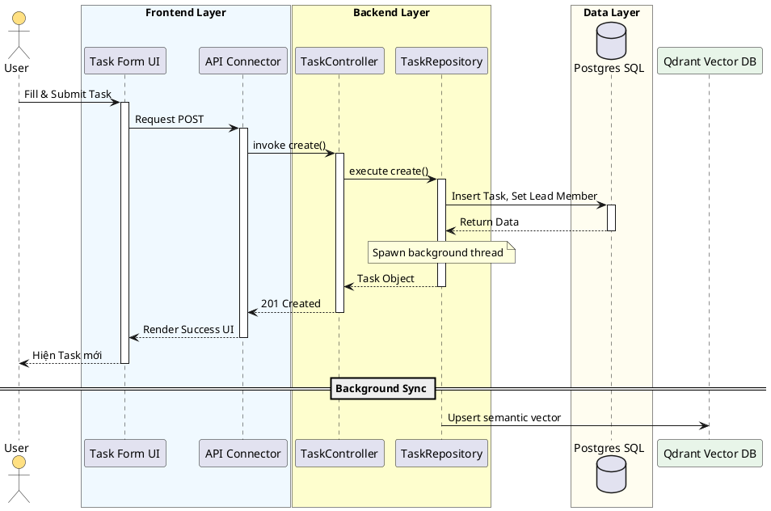
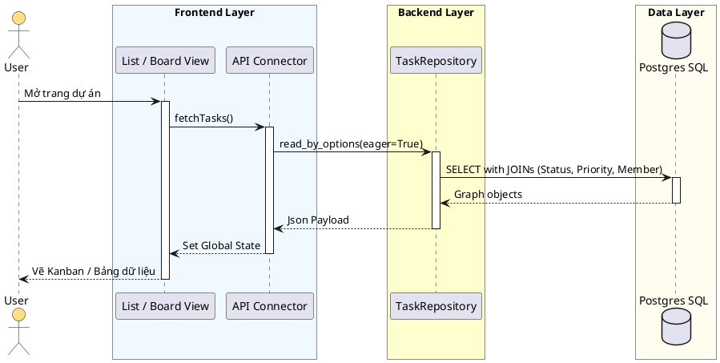
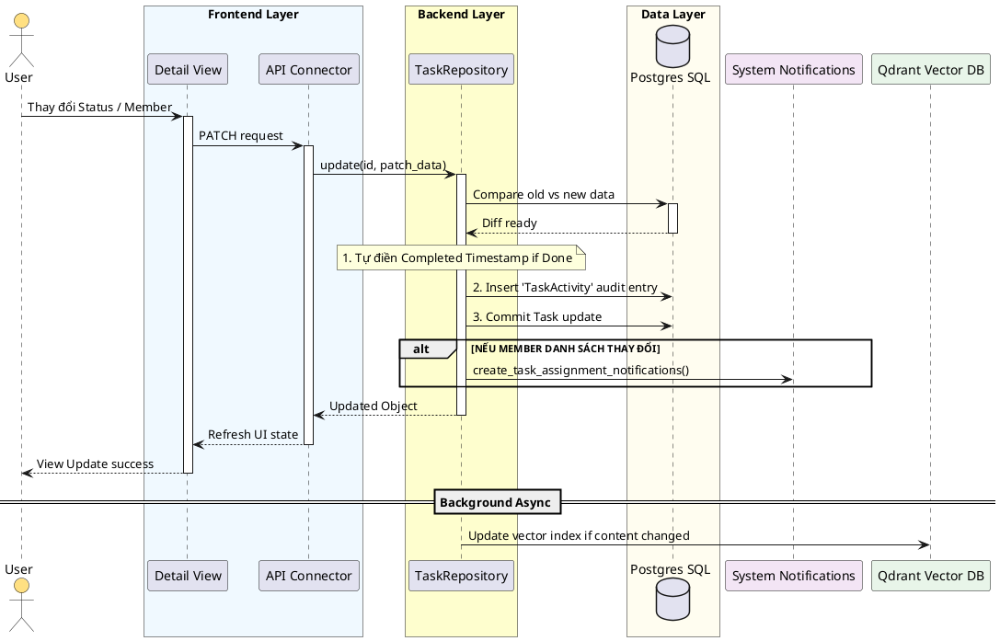
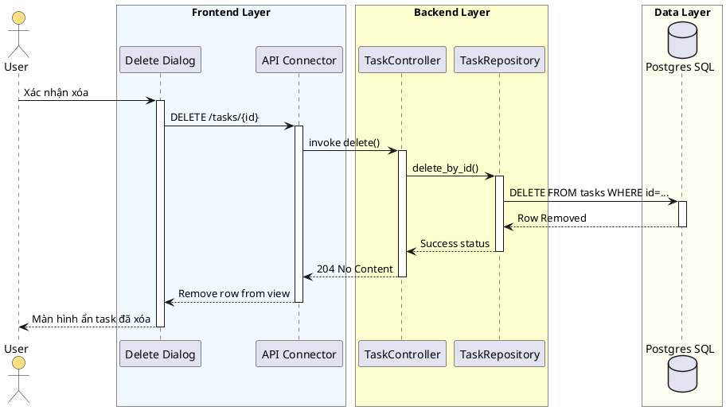

# Tài liệu Kỹ thuật: Quy trình CRUD Tác vụ (Task Core Operations) - Agentick

Tài liệu này mô tả chi tiết 4 thao tác cốt lõi (Create, Read, Update, Delete) của hệ thống quản lý Task, nhấn mạnh sự liên kết với các hệ thống bên ngoài (Qdrant, Notifications).

---

## 1. Quy trình Tạo mới (CREATE)

**Đặc điểm:** Lưu dữ liệu Transactional vào SQL và đồng bộ ngữ nghĩa (Semantic content) sang Qdrant Vector DB chạy ngầm để phục vụ AI RAG.

---

## 2. Quy trình Đọc dữ liệu (READ)

**Đặc điểm:** Hỗ trợ load danh sách kèm tính năng `Eager Load` để tự động nạp thông tin người đại diện, phase và độ ưu tiên trong duy nhất một câu query JOIN.

---

## 3. Quy trình Cập nhật (UPDATE)

**Đặc điểm:** Đây là luồng phức tạp nhất. Hệ thống tự động diff dữ liệu để ghi **Audit Log** vào bảng `TaskActivity`, đồng thời nếu đổi người được giao, hệ thống tự bắn **Notification** và re-sync vector.

---

## 4. Quy trình Xóa (DELETE)

**Đặc điểm:** Xóa vật lý bản ghi khỏi PostgreSQL (Cascade delete task_members theo cấu hình DB).

